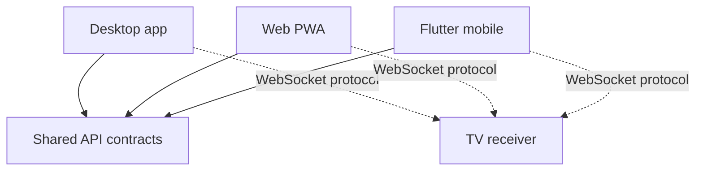

# Architecture overview

## Product model

The desktop application is the feature reference. Web and mobile implement parity through shared contracts, not copied UI code. TV receivers are display clients controlled through the project WebSocket protocol.

## Component responsibilities

| Component | Responsibility |
|---|---|
| Desktop app | Native creation, playback and presentation workflows |
| Web PWA | Browser workflow using shared contracts |
| Mobile app | Offline-first companion using shared contracts |
| API | Versioned content, authentication and service contracts |
| TV receiver | Presentation display client |
| Receiver update channel | Receiver distribution and updates |

## Principles

### Contract parity, not code parity

A shared feature must expose compatible API behavior to desktop, web and mobile. Each client uses its native implementation stack.

### TV as a display client

The receiver connects using the project WebSocket protocol. Chromecast and AirPlay are not part of this architecture. See [ADR-001](../adr/001-ws-proprio-multi-device.md).

### Explicit failure behavior

Client configuration and API fallback behavior must fail clearly and be tested at the boundary. Avoid hidden defaults for contract endpoints.

### Offline-first mobile

The mobile application uses local cache before network access where supported. Treat sync, retries and unavailable data as product behavior requiring tests.

### Local machine preferences stay local

Presentation or player preferences are device concerns. They are not automatically shared through user-facing content contracts.
