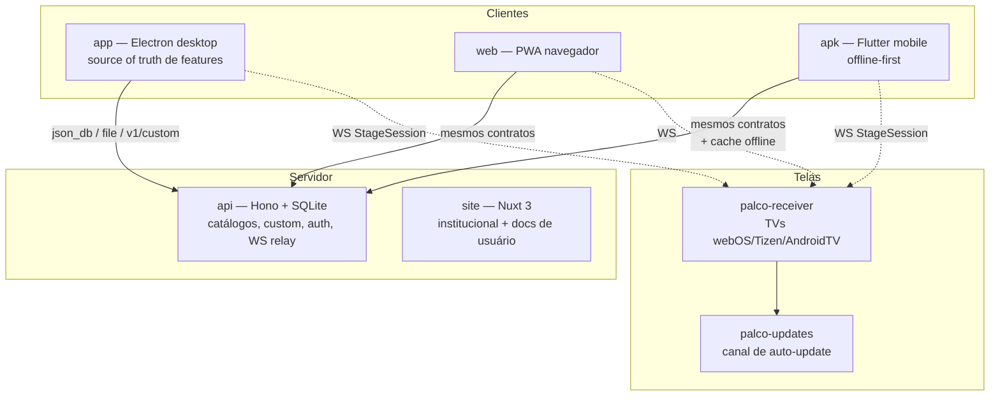

# Arquitetura — Visão Geral Multi-Device

## O ecossistema em uma frase

O **desktop (app)** é a fonte de referência de funcionalidades; web e APK
replicam por **paridade de contratos** (mesma API, não mesmo código); as TVs
são **dumb displays** controlados via WebSocket próprio.

## Papel de cada peça

| Peça | Papel | Nota crítica |
|------|-------|--------------|
| **app** | Desktop nativo; onde as features nascem | Projeção multi-monitor, player externo (VLC), engine de apresentação |
| **web** | Uso no navegador, sem instalação | Sem spawn de processos (player sempre interno) |
| **apk** | O "celular do operador"; maioria dos usuários está aqui | Downloads offline no sandbox do app |
| **api** | Catálogos (hinários PT/ES/EN), conteúdo custom, auth, arquivos | Contrato único para os 3 clientes |
| **site** | Divulgação + documentação de usuário final | Docs de DEV ficam neste repo (docs) |
| **palco-receiver** | Tela burra na TV | Conecta-se ao cliente — nunca o contrário |
| **palco-updates** | Auto-update dos receivers | GitHub Pages |

## Princípios

### 1. Paridade por contrato, não por código

Feature nova no desktop precisa ter caminho em web e APK. Isso significa
**consumir os mesmos endpoints** (`/v1/custom`, `/file/custom/*`, `/json_db/*`),
não copiar implementação. Cada plataforma usa seu idioma nativo (Vue, Flutter).

### 2. TV = dumb display via WS próprio (ADR-001)

O receiver conecta-se ao cliente (desktop, web **ou celular**) via WebSocket.
O StageSession vive no APK: o **celular controla a projeção na TV**.
**Chromecast/AirPlay não existem no projeto.** Para TVs fora da rede local,
existe relay cloud na API.

### 3. Cascata de fallback de APIs

Os 3 clientes suportam múltiplas bases de API (primária + fallbacks separados
por vírgula via env/dart-define). Cai para o próximo host em falha de rede/5xx/404;
429 faz backoff na mesma host. Nenhuma URL é hardcoded — build sem env = falha
explícita e cedo.

### 4. Offline-first no APK

Downloads de músicas ficam em `getApplicationDocumentsDirectory()/music-offline`
(sandbox privado). O cliente consulta cache local antes da rede.

### 5. Recursos locais ficam na máquina, não na conta

Player externo e engine de apresentação são preferências globais do workspace
em disco (da máquina) — não viajam pela API. O contrato de liturgia (.slja) é
tolerante: campos opcionais desconhecidos são ignorados por clientes antigos.
