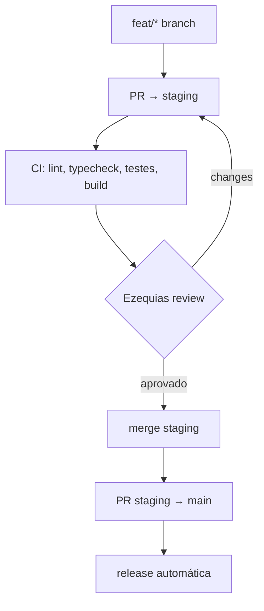

# Pianolouvorja App Electron Workflow

> **Metodologia pública** — ciclo de trabalho: branch, teste, PR, release multi-plataforma. Aplica-se a qualquer stack.

---

## Ciclo de desenvolvimento



## Branch naming

| Tipo | Pattern | Exemplo |
|------|---------|---------|
| Feature | `feat/<scope>-<slug>` | `feat/liturgy-sync-offline` |
| Bug fix | `fix/<scope>-<slug>` | `fix/audio-stop-on-background` |
| Chore | `chore/<scope>-<slug>` | `chore/deps-update-biome` |
| Docs | `docs/<scope>-<slug>` | `docs/readme-typo-fix` |

## Commit messages

```
feat(scope): descrição curta no imperativo
fix(scope): correção
docs: mudança de documentação
ci: mudança de CI
chore: manutenção
```

Exemplo: `feat(liturgy): add offline sync for weekend masses`

## CI Pipeline (obrigatório passar)

```yaml
# .github/workflows/ci.yml
- Lint + Format: Biome
- Type Check: vue-tsc
- Build: Vite + electron-builder
- Testes: Vitest (unit + integration)
```

## Release multi-plataforma

| Plataforma | Artefato | Canal |
|------------|----------|-------|
| Windows | `.exe` (NSIS) | GitHub Releases |
| macOS | `.dmg` (universal) | GitHub Releases |
| Linux | `.AppImage` / `.deb` | GitHub Releases |

## Versionamento

```bash
npm run version:min   # bug fix (patch)
npm run version:bug   # bug fix (patch)
# gera commit + tag vX.Y.Z automaticamente
```

## Debugging

| Ferramenta | Como |
|------------|------|
| DevTools | `ELECTRON_OPEN_DEVTOOLS=1 npm run dev` |
| CDP | `chrome://inspect` → port 9222 |
| IPC | `ELECTRON_LOG_IPC=1` |

## Pitfalls (NUNCA faça)

- ❌ `window.confirm` — use `AppConfirm` (AppConfirm.ts)
- ❌ `git checkout -- .` sem `git status` antes
- ❌ Reformatting pré-existente junto com feature
- ❌ `window.confirm` no renderer
- ❌ Testar projeção com música mundana (SACRA IASD apenas)
- ❌ Assumir migration rodou no deploy — verificar

## Referências

- [Electron Security](https://www.electronjs.org/docs/latest/tutorial/security)
- [AppConfirm pattern](AppConfirm.ts)
- [pianolouvorja-app-electron](../pianolouvorja-app-electron.md) — arquitetura
- [pianolouvorja-ui-patterns](../pianolouvorja-ui-patterns.md) — design system
